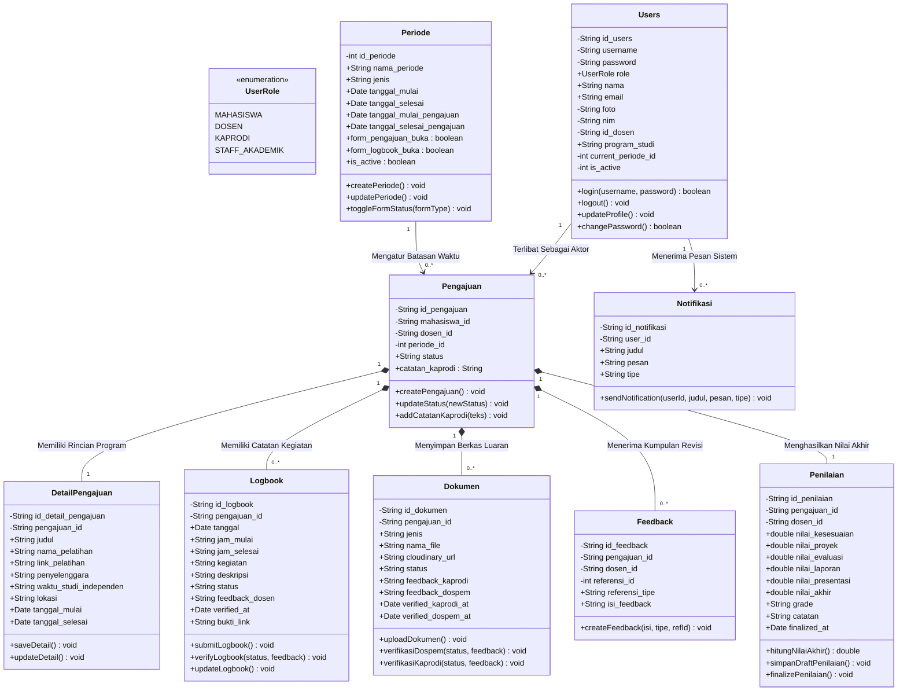

```mermaid
classDiagram
    direction TB

    %% Mendefinisikan Tipe Enum untuk Hak Akses/Role %%
    class UserRole {
        <<enumeration>>
        MAHASISWA
        DOSEN
        KAPRODI
        STAFF_AKADEMIK
    }

    class Users {
        -String id_users
        -String username
        -String password
        +UserRole role
        +String nama
        +String email
        -String foto
        -String nim
        -String id_dosen
        +String program_studi
        -int current_periode_id
        -int is_active
        +login(username, password) boolean
        +logout() void
        +updateProfile() void
        +changePassword() boolean
    }

    class Periode {
        -int id_periode
        +String nama_periode
        +String jenis
        +Date tanggal_mulai
        +Date tanggal_selesai
        +Date tanggal_mulai_pengajuan
        +Date tanggal_selesai_pengajuan
        +form_pengajuan_buka : boolean
        +form_logbook_buka : boolean
        +is_active : boolean
        +createPeriode() void
        +updatePeriode() void
        +toggleFormStatus(formType) void
    }

    class Pengajuan {
        -String id_pengajuan
        -String mahasiswa_id
        -String dosen_id
        -int periode_id
        +String status
        +catatan_kaprodi : String
        +createPengajuan() void
        +updateStatus(newStatus) void
        +addCatatanKaprodi(teks) void
    }

    class DetailPengajuan {
        -String id_detail_pengajuan
        -String pengajuan_id
        +String judul
        +String nama_pelatihan
        +String link_pelatihan
        +String penyelenggara
        +String waktu_studi_independen
        +String lokasi
        +Date tanggal_mulai
        +Date tanggal_selesai
        +saveDetail() void
        +updateDetail() void
    }

    class Logbook {
        -String id_logbook
        -String pengajuan_id
        +Date tanggal
        +String jam_mulai
        +String jam_selesai
        +String kegiatan
        +String deskripsi
        +String status
        +String feedback_dosen
        +Date verified_at
        +String bukti_link
        +submitLogbook() void
        +verifyLogbook(status, feedback) void
        +updateLogbook() void
    }

    class Dokumen {
        -String id_dokumen
        -String pengajuan_id
        +String jenis
        +String nama_file
        +String cloudinary_url
        +String status
        +String feedback_kaprodi
        +String feedback_dospem
        +Date verified_kaprodi_at
        +Date verified_dospem_at
        +uploadDokumen() void
        +verifikasiDospem(status, feedback) void
        +verifikasiKaprodi(status, feedback) void
    }

    class Feedback {
        -String id_feedback
        -String pengajuan_id
        -String dosen_id
        -int referensi_id
        +String referensi_tipe
        +String isi_feedback
        +createFeedback(isi, tipe, refId) void
    }

    class Notifikasi {
        -String id_notifikasi
        -String user_id
        +String judul
        +String pesan
        +String tipe
        +sendNotification(userId, judul, pesan, tipe) void
    }

    class Penilaian {
        -String id_penilaian
        -String pengajuan_id
        -String dosen_id
        +double nilai_kesesuaian
        +double nilai_proyek
        +double nilai_evaluasi
        +double nilai_laporan
        +double nilai_presentasi
        +double nilai_akhir
        +String grade
        +String catatan
        +Date finalized_at
        +hitungNilaiAkhir() double
        +simpanDraftPenilaian() void
        +finalizePenilaian() void
    }

    %% HUBUNGAN RELASI ANTAR KELAS (AKURAT) %%
    Users "1" --> "0..*" Pengajuan : Terlibat Sebagai Aktor
    Periode "1" --> "0..*" Pengajuan : Mengatur Batasan Waktu
    Users "1" --> "0..*" Notifikasi : Menerima Pesan Sistem

    %% Hubungan Komposisi Berpusat Pada Pengajuan %%
    Pengajuan "1" *-- "1" DetailPengajuan : Memiliki Rincian Program
    Pengajuan "1" *-- "0..*" Logbook : Memiliki Catatan Kegiatan
    Pengajuan "1" *-- "0..*" Dokumen : Menyimpan Berkas Luaran
    Pengajuan "1" *-- "0..*" Feedback : Menerima Kumpulan Revisi
    Pengajuan "1" *-- "1" Penilaian : Menghasilkan Nilai Akhir
```

```mermaid
classDiagram
    direction TB

    %% Mendefinisikan Tipe Enum untuk Hak Akses/Role %%
    class UserRole {
        <<enumeration>>
        MAHASISWA
        DOSEN
        KAPRODI
        STAFF_AKADEMIK
    }

    class Users {
        -String id_users
        -String username
        -String password
        +UserRole role
        +String nama
        +String email
        -String foto
        -String nim
        -String id_dosen
        +String program_studi
        -int current_periode_id
        -int is_active
        +login(username, password) boolean
        +logout() void
        +updateProfile() void
        +changePassword() boolean
    }

    class Periode {
        -int id_periode
        +String nama_periode
        +String jenis
        +Date tanggal_mulai
        +Date tanggal_selesai
        +Date tanggal_mulai_pengajuan
        +Date tanggal_selesai_pengajuan
        +form_pengajuan_buka : boolean
        +form_logbook_buka : boolean
        +is_active : boolean
        +createPeriode() void
        +updatePeriode() void
        +toggleFormStatus(formType) void
    }

    class Pengajuan {
        -String id_pengajuan
        -String mahasiswa_id
        -String dosen_id
        -int periode_id
        +String status
        +catatan_kaprodi : String
        +createPengajuan() void
        +updateStatus(newStatus) void
        +addCatatanKaprodi(teks) void
    }

    class DetailPengajuan {
        -String id_detail_pengajuan
        -String pengajuan_id
        +String judul
        +String nama_pelatihan
        +String link_pelatihan
        +String penyelenggara
        +String waktu_studi_independen
        +String lokasi
        +Date tanggal_mulai
        +Date tanggal_selesai
        +saveDetail() void
        +updateDetail() void
    }

    class Logbook {
        -String id_logbook
        -String pengajuan_id
        +Date tanggal
        +String jam_mulai
        +String jam_selesai
        +String kegiatan
        +String deskripsi
        +String status
        +String feedback_dosen
        +Date verified_at
        +String bukti_link
        +submitLogbook() void
        +verifyLogbook(status, feedback) void
        +updateLogbook() void
    }

    class Dokumen {
        -String id_dokumen
        -String pengajuan_id
        +String jenis
        +String nama_file
        +String cloudinary_url
        +String status
        +String feedback_kaprodi
        +String feedback_dospem
        +Date verified_kaprodi_at
        +Date verified_dospem_at
        +uploadDokumen() void
        +verifikasiDospem(status, feedback) void
        +verifikasiKaprodi(status, feedback) void
    }

    class Feedback {
        -String id_feedback
        -String pengajuan_id
        -String dosen_id
        -int referensi_id
        +String referensi_tipe
        +String isi_feedback
        +createFeedback(isi, tipe, refId) void
    }

    class Notifikasi {
        -String id_notifikasi
        -String user_id
        +String judul
        +String pesan
        +String tipe
        +sendNotification(userId, judul, pesan, tipe) void
    }

    class Penilaian {
        -String id_penilaian
        -String pengajuan_id
        -String dosen_id
        +double nilai_kesesuaian
        +double nilai_proyek
        +double nilai_evaluasi
        +double nilai_laporan
        +double nilai_presentasi
        +double nilai_akhir
        +String grade
        +String catatan
        +Date finalized_at
        +hitungNilaiAkhir() double
        +simpanDraftPenilaian() void
        +finalizePenilaian() void
    }

    %% HUBUNGAN RELASI ANTAR KELAS (AKURAT) %%
    Users "1" --> "0..*" Pengajuan : Terlibat Sebagai Aktor
    Periode "1" --> "0..*" Pengajuan : Mengatur Batasan Waktu
    Users "1" --> "0..*" Notifikasi : Menerima Pesan Sistem

    %% Hubungan Komposisi Berpusat Pada Pengajuan %%
    Pengajuan "1" *-- "1" DetailPengajuan : Memiliki Rincian Program
    Pengajuan "1" *-- "0..*" Logbook : Memiliki Catatan Kegiatan
    Pengajuan "1" *-- "0..*" Dokumen : Menyimpan Berkas Luaran
    Pengajuan "1" *-- "0..*" Feedback : Menerima Kumpulan Revisi
    Pengajuan "1" *-- "1" Penilaian : Menghasilkan Nilai Akhir
```
